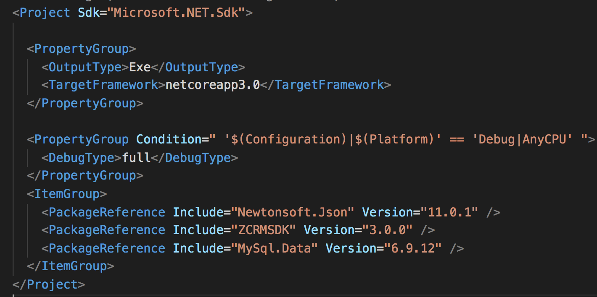
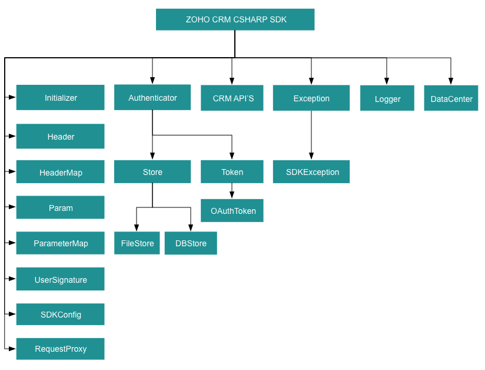

# Archival Notice:

$${\color{red}This \space version \space of \space SDK \space is \space archived}$$. You can continue to use it, but no new features or support requests will be accepted. We recommend using our latest [SDK version](https://www.zoho.com/crm/developer/docs/sdk/server-side/csharp-sdk.html).

# ZOHO CRM C# SDK

## Table Of Contents

* [Overview](#overview)
* [Registering a Zoho Client](#registering-a-zoho-client)
* [Environmental Setup](#environmental-setup)
* [Including the SDK in your project](#including-the-sdk-in-your-project)
* [Persistence](#token-persistence)
  * [DataBase Persistence](#database-persistence)
  * [File Persistence](#file-persistence)
  * [Custom Persistence](#custom-persistence)
* [Configuration](#configuration)
* [Initialization](#initializing-the-application)
* [Class Hierarchy](#class-hierarchy)
* [Responses And Exceptions](#responses-and-exceptions)
* [Threading](#threading-in-the-c#-sdk)
  * [Multithreading in a Multi-User App](#multithreading-in-a-multi-user-app)
  * [Multi-threading in a Single User App](#multi-threading-in-a-single-user-app)
* [Sample Code](#sdk-sample-code)

## Overview

Zoho CRM C# SDK offers a way to create client C# applications that can be integrated with Zoho CRM.

## Registering a Zoho Client

Since Zoho CRM APIs are authenticated with OAuth2 standards, you should register your client app with Zoho. To register your app:

- Visit this page [https://api-console.zoho.com/](https://api-console.zoho.com)

- Click on `ADD CLIENT`.

- Choose a `Client Type`.

- Enter **Client Name**, **Client Domain** or **Homepage URL** and **Authorized Redirect URIs**. Click `CREATE`.

- Your Client app will be created and displayed.

- Select the created OAuth client.

- Generate grant token by providing the necessary scopes, time duration (the duration for which the generated token is valid) and Scope Description.

## Environmental Setup

C# SDK requires .NET Framework 4.6.1 or above to be set up in your development environment.

## Including the SDK in your project

You can include the SDK to your project using:

1. Install Visual Studio IDE from [Visual Studio](https://visualstudio.microsoft.com/downloads/) (if not installed).

2. C# SDK is available as a Nuget package. The ZCRMSDK assembly can be installed through the Nuget Package Manager or through the following options:

    - Package Manager

        ```sh
        Install-Package ZCRMSDK -Version 3.1.0
        Install-Package MySql.Data -Version 6.9.12
        Install-Package Newtonsoft.Json -Version 11.0.1
        ```

    - .NET  CLI

        ```sh
        dotnet add package ZCRMSDK --version 3.1.0
        dotnet add package Newtonsoft.Json --version 11.0.1
        dotnet add package MySql.Data --version 6.9.12
        ```

    - PackageReference

        For projects that support PackageReference, copy this XML node into the project file to refer the package.

        ```sh
        <ItemGroup>
            <PackageReference Include="ZCRMSDK" Version="3.1.0" />
            <PackageReference Include="Newtonsoft.Json" Version="11.0.1" />
            <PackageReference Include="MySql.Data" Version="6.9.12" />
        </ItemGroup>
        ```

        - A sample **.csproj** file

        

## Token Persistence

Token persistence refers to storing and utilizing the authentication tokens that are provided by Zoho. There are three ways provided by the SDK in which persistence can be utilized. They are DataBase Persistence, File Persistence, and Custom Persistence.

### Table of Contents

- [DataBase Persistence](#database-persistence)

- [File Persistence](#file-persistence)

- [Custom Persistence](#custom-persistence)

### Implementing OAuth Persistence

Once the application is authorized, OAuth access and refresh tokens can be used for subsequent user data requests to Zoho CRM. Hence, they need to be persisted by the client app.

The persistence is achieved by writing an implementation of the inbuilt **[TokenStore](ZohoCRM/Com/Zoho/API/Authenticator/Store/TokenStore.cs) interface**, which has the following callback methods.

- **GetToken([UserSignature](Resources/UserSignature.md#usersignature) user, [Token](ZohoCRM/Com/Zoho/API/Authenticator/Token.cs) token)** - invoked before firing a request to fetch the saved tokens. This method should return an implementation of **Token interface** object for the library to process it.

- **SaveToken([UserSignature](Resources/UserSignature.md#usersignature) user, [Token](ZohoCRM/Com/Zoho/API/Authenticator/Token.cs) token)** - invoked after fetching access and refresh tokens from Zoho.

- **DeleteToken([Token](ZohoCRM/Com/Zoho/API/Authenticator/Token.cs) token)** - invoked before saving the latest tokens.

- **GetTokens()** - The method to retrieve all the stored tokens.

- **DeleteTokens()** - The method to delete all the stored tokens.

### DataBase Persistence

In case the user prefers to use the default DataBase persistence, **MySQL** can be used.

- The database name should be **zohooauth**.

- There must be a table named **oauthtoken** with the following columns.

  - id int(11)

  - user_mail varchar(255)

  - client_id varchar(255)

  - refresh_token varchar(255)

  - access_token varchar(255)

  - grant_token varchar(255)

  - expiry_time varchar(20)

#### MySQL Query

```sql
create table oauthtoken(id int(11) not null auto_increment, user_mail varchar(255) not null, client_id varchar(255), refresh_token varchar(255), access_token varchar(255), grant_token varchar(255), expiry_time varchar(20), primary key (id));

alter table oauthtoken auto_increment = 1;
```

#### Create DBStore object

```C#
/*
* 1 -> DataBase host name. Default value "localhost"
* 2 -> DataBase name. Default  value "zohooauth"
* 3 -> DataBase user name. Default value "root"
* 4 -> DataBase password. Default value ""
* 5 -> DataBase port number. Default value "3306"
*/
TokenStore tokenstore = new DBStore();
//TokenStore interface
TokenStore tokenstore = new DBStore("hostName", "dataBaseName", "userName", "password", "portNumber");
```

### File Persistence

In case of default File Persistence, the user can persist tokens in the local drive, by providing the the absolute file path to the FileStore object.

- The File contains.

  - user_mail

  - client_id

  - refresh_token

  - access_token

  - grant_token

  - expiry_time

#### Create FileStore object

```C#
//Parameter containing the absolute file path to store tokens
TokenStore tokenstore = new FileStore("/Users/user_name/Documents/csharp_sdk_token.txt");
```

### Custom Persistence

To use Custom Persistence, the user must implement **TokenStore interface**(**Com.Zoho.API.Authenticator.Store.TokenStore**) and override the methods.

```C#
using System;
using Com.Zoho.API.Authenticator;
using Com.Zoho.API.Authenticator.Store;
using Com.Zoho.Crm.API;

namespace user.store
{
    public class CustomStore : TokenStore
    {
        public CustomStore()
        {
        }

        /// <summary></summary>
        /// <param name="user">A UserSignature class instance.</param>
        /// <param name="token">A Token (Com.Zoho.API.Authenticator.OAuthToken) class instance.</param>
        /// <returns>A Token class instance representing the user token details.</returns>
        public Token GetToken(UserSignature user, Token token)
        {
            // Add code to get the token
            return null;
        }

        /// <summary></summary>
        /// <param name="user">A UserSignature class instance.</param>
        /// <param name="token">A Token (Com.Zoho.API.Authenticator.OAuthToken) class instance.</param>
        public void SaveToken(UserSignature user, Token token)
        {
            // Add code to save the token
        }

        /// <summary></summary>
        /// <param name="user">A UserSignature class instance.</param>
        /// <param name="token">A Token (Com.Zoho.API.Authenticator.OAuthToken) class instance.</param>
        public void DeleteToken(UserSignature user, Token token)
        {
            // Add code to delete the token
        }

        public void GetTokens()
        {
            // Add code to get the all stored tokens
        }

        public void DeleteTokens()
        {
            // Add code to delete the all stored token
        }
    }
}
```

## Configuration

Before you get started with creating your C# application, you need to register your client and authenticate the app with Zoho.

- Create an instance of **[Logger](Resources/Logger/Logger.md#logger)** Class to log exception and API information.

    ```C#
    /*
        * Create an instance of Logger Class that takes two parameters
        * 1 -> Level of the log messages to be logged. Can be configured by typing Levels "." and choose any level from the list displayed.
        * 2 -> Absolute file path, where messages need to be logged.
    */
    Logger logger = Logger.GetInstance(Logger.Levels.ALL, "/Users/Documents/csharp_sdk_log.log");
    ```

- Create an instance of **[UserSignature](Resources/UserSignature.md#usersignature)** that identifies the current user.

    ```C#
    //Create an UserSignature instance that takes user Email as parameter
    UserSignature user = new UserSignature("abc@zoho.com");
    ```

- Configure API environment which decides the domain and the URL to make API calls.

    ```C#
    /*
        * Configure the environment
        * which is of the pattern Domain.Environment
        * Available Domains: USDataCenter, EUDataCenter, INDataCenter, CNDataCenter, AUDataCenter
        * Available Environments: PRODUCTION, DEVELOPER, SANDBOX
    */
    Environment environment = USDataCenter.PRODUCTION;
    ```

- Create an instance of **[OAuthToken](Resources/OAuthToken.md)** with the information that you get after registering your Zoho client.

    ```C#
    /*
        * Create a Token instance
        * 1 -> OAuth client id.
        * 2 -> OAuth client secret.
        * 3 -> REFRESH/GRANT token.
        * 4 -> Token type(REFRESH/GRANT).
        * 5 -> OAuth redirect URL.
    */
    Token token = new OAuthToken("clientId", "clientSecret", "REFRESH/GRANT token", TokenType.REFRESH/GRANT, "redirectURL");
    ```

- Create an instance of **[TokenStore](ZohoCRM/Com/Zoho/API/Authenticator/Store/TokenStore.cs)** to persist tokens that are  used for authenticating all the requests.

    ```C#
    /*
        * Create an instance of TokenStore.
        * 1 -> DataBase host name. Default "localhost"
        * 2 -> DataBase name. Default "zohooauth"
        * 3 -> DataBase user name. Default "root"
        * 4 -> DataBase password. Default ""
        * 5 -> DataBase port number. Default "3306"
    */
    //TokenStore tokenstore = new DBStore();

    TokenStore tokenstore = new DBStore("hostName", "dataBaseName", "userName", "password", "portNumber");

    //TokenStore tokenstore = new FileStore("absolute_file_path");  

    //TokenStore tokenStore = new CustomStore();
    ```

- Create an instance of **[SDKConfig](Resources/SDKConfig.md)** containing the SDK configuration.

    ```C#
    /*
    * autoRefreshFields
    * if true - all the modules' fields will be auto-refreshed in the background, every    hour.
    * if false - the fields will not be auto-refreshed in the background. The user can manually delete the file(s) or refresh the fields using methods from ModuleFieldsHandler(Com.Zoho.Crm.API.Util.ModuleFieldsHandler)
    *
    * pickListValidation
    * A boolean field that validates user input for a pick list field and allows or disallows the addition of a new value to the list.
    * True - the SDK validates the input. If the value does not exist in the pick list, the SDK throws an error.
    * False - the SDK does not validate the input and makes the API request with the user’s input to the pick list
    */
    SDKConfig config = new SDKConfig.Builder().SetAutoRefreshFields(false).SetPickListValidation(true).Build();
    ```

- The path containing the absolute directory path to store user-specific files containing module fields information.

    ```C#
    string resourcePath = "/Users/user_name/Documents/csharpsdk-application";
    ```

- Create an instance of **[RequestProxy](resources/RequestProxy.md)** containing the proxy properties of the user.

    ```C#
    RequestProxy RequestProxy = new RequestProxy("proxyHost", "proxyPort", "proxyUser", "password", "userDomain");
    ```

## Initializing the Application

Initialize the SDK using the following code.

```C#
using System;
using Com.Zoho.API.Authenticator;
using Com.Zoho.API.Authenticator.Store;
using Com.Zoho.Crm.API;
using Com.Zoho.Crm.API.Dc;
using Com.Zoho.Crm.API.Logger;
using static Com.Zoho.API.Authenticator.OAuthToken;
using Environment = Com.Zoho.Crm.API.Dc.DataCenter.Environment;
using SDKInitializer = Com.Zoho.Crm.API.Initializer;

namespace Com.Zoho.Crm.Sample.Initializer
{
    public class Initialize
    {
        public static void SDKInitialize()
        {
            /*
            * Create an instance of Logger Class that takes two parameters
            * 1 -> Level of the log messages to be logged. Can be configured by typing Levels "." and choose any level from the list displayed.
            * 2 -> Absolute file path, where messages need to be logged.
            */
            Logger logger = Logger.GetInstance(Logger.Levels.ALL, "/Users/Documents/csharp_sdk_log.log");

            //Create an UserSignature instance that takes user Email as parameter
            UserSignature user = new UserSignature("abc@zoho.com");

            /*
            * Configure the environment
            * which is of the pattern Domain.Environment
            * Available Domains: USDataCenter, EUDataCenter, INDataCenter, CNDataCenter, AUDataCenter
            * Available Environments: PRODUCTION, DEVELOPER, SANDBOX
            */
            Environment environment = USDataCenter.PRODUCTION;

            /*
            * Create a Token instance
            * 1 -> OAuth client id.
            * 2 -> OAuth client secret.
            * 3 -> REFRESH/GRANT token.
            * 4 -> Token type(REFRESH/GRANT).
            * 5 -> OAuth redirect URL.
            */
            Token token = new OAuthToken("clientId", "clientSecret", "REFRESH/GRANT token", TokenType.REFRESH/GRANT, "redirectURL");

            /*
                * Create an instance of TokenStore.
                * 1 -> DataBase host name. Default "localhost"
                * 2 -> DataBase name. Default "zohooauth"
                * 3 -> DataBase user name. Default "root"
                * 4 -> DataBase password. Default ""
                * 5 -> DataBase port number. Default "3306"
            */
            //TokenStore tokenstore = new DBStore();

            TokenStore tokenstore = new DBStore("hostName", "dataBaseName", "userName", "password", "portNumber");

            // TokenStore tokenstore = new FileStore("absolute_file_path");

            /*
            * autoRefreshFields
            * if true - all the modules' fields will be auto-refreshed in the background, every    hour.
            * if false - the fields will not be auto-refreshed in the background. The user can manually delete the file(s) or refresh the fields using methods from ModuleFieldsHandler(com.zoho.crm.api.util.ModuleFieldsHandler)
            *
            * pickListValidation
            * if true - value for any picklist field will be validated with the available values.
            * if false - value for any picklist field will not be validated, resulting in creation of a new value.
            */
            SDKConfig sdkConfig = new SDKConfig.Builder().SetAutoRefreshFields(false).SetPickListValidation(true).Build();

            string resourcePath = "/Users/user_name/Documents/csharpsdk-application";

            /**
            * Create an instance of RequestProxy class that takes the following parameters
            * 1 -> Host
            * 2 -> Port Number
            * 3 -> User Name
            * 4 -> Password
            * 5 -> User Domain
            */
            // RequestProxy requestProxy = new RequestProxy("proxyHost", "proxyPort", "proxyUser", "password");

            RequestProxy requestProxy = new RequestProxy("proxyHost", "proxyPort", "proxyUser", "password", "userDomain");

            /*
            * The initialize method of Initializer class that takes the following arguments
            * 1 -> UserSignature instance
            * 2 -> Environment instance
            * 3 -> Token instance
            * 4 -> TokenStore instance
            * 5 -> SDKConfig instance
            * 6 -> resourcePath -A String
            * 7 -> Logger instance
            * 8 -> RequestProxy instance
            */

            // The following are the available initialize methods

            SDKInitializer.Initialize(user, environment, token, tokenstore, sdkConfig, resourcePath);

            SDKInitializer.Initialize(user, environment, token, tokenstore, sdkConfig, resourcePath, logger);

            SDKInitializer.Initialize(user, environment, token, tokenstore, sdkConfig, resourcePath, requestProxy);

            SDKInitializer.Initialize(user, environment, token, tokenstore, sdkConfig, resourcePath, logger, requestProxy);
        }
    }
}
```

- You can now access the functionalities of the SDK. Refer to the sample codes to make various API calls through the SDK.

## Class Hierarchy



## Responses and Exceptions

All SDK method calls return an instance of the **[APIResponse](Resources/Util/APIResponse.md#apiresponse)** class

Use the **Object** Property in the returned **[APIResponse](Resources/Util/APIResponse.md#apiresponse)** object to obtain the response handler interface depending on the type of request (**GET, POST,PUT,DELETE**).

**APIResponse&lt;ResponseHandler&gt;** and **APIResponse&lt;ActionHandler&gt;** are the common wrapper objects for Zoho CRM APIs’ responses.

Whenever the API returns an error response, the response will be an instance of **APIException** class.

All other exceptions such as SDK anomalies and other unexpected behaviours are thrown under the **[SDKException](Resources/Exception/SDKException.md#sdkexception)** class.

- For operations involving records in Tags
  - **APIResponse&lt;RecordActionHandler&gt;**

- For getting Record Count for a specific Tag operation
  
  - **APIResponse&lt;CountHandler&gt;**

- For operations involving BaseCurrency

  - **APIResponse&lt;BaseCurrencyActionHandler&gt;**

- For Lead convert operation

  - **APIResponse&lt;ConvertActionHandler&gt;**

- For retrieving Deleted records operation

  - **APIResponse&lt;DeletedRecordsHandler&gt;**

- For  Record image download operation

  - **APIResponse&lt;DownloadHandler&gt;**

- For MassUpdate record operations

  - **APIResponse&lt;MassUpdateActionHandler&gt;**

  - **APIResponse&lt;MassUpdateResponseHandler&gt;**

### GET Requests

- The **Object** Property of the returned APIResponse instance returns the response handler interface.

- The **ResponseHandler interface** interface encompasses the following
  - **ResponseWrapper class** (for **application/json** responses)
  - **FileBodyWrapper class** (for File download responses)
  - **APIException class**

- The **CountHandler interface** encompasses the following
  - **CountWrapper class** (for **application/json** responses)
  - **APIException class**

- The **DeletedRecordsHandler interface** encompasses the following
  - **DeletedRecordsWrapper class** (for **application/json** responses)
  - **APIException class**

- The **DownloadHandler interface** encompasses the following
  - **FileBodyWrapper class** (for File download responses)
  - **APIException class**

- The **MassUpdateResponseHandler interface** encompasses the following
  - **MassUpdateResponseWrapper class** (for **application/json** responses)
  - **APIException class**

### POST, PUT, DELETE Requests

- The **Object** Property of the returned APIResponse instance returns the action handler interface.

- The **ActionHandler interface** encompasses the following
  - **ActionWrapper class** (for **application/json** responses)
  - **APIException class**

- The **ActionWrapper class** contains **Property/Properties** that may contain one/list of **ActionResponse interfaces**.

- The **ActionResponse interface** encompasses following
  - **SuccessResponse class** (for **application/json** responses)
  - **APIException class**

- The **ActionHandler interface** encompasses following
  - **ActionWrapper class** (for **application/json** responses)
  - **APIException class**

- The **RecordActionHandler interface** encompasses following
  - **RecordActionWrapper class** (for **application/json** responses)
  - **APIException class**

- The **BaseCurrencyActionHandler interface** encompasses following
  - **BaseCurrencyActionWrapper class** (for **application/json** responses)
  - **APIException class**

- The **MassUpdateActionHandler interface** encompasses following
  - **MassUpdateActionWrapper class** (for **application/json** responses)
  - **APIException class**

- The **ConvertActionHandler interface** encompasses following
  - **ConvertActionWrapper class** (for **application/json** responses)
  - **APIException class**

## Threading in the C# SDK

Threads in a C# program help you achieve parallelism. By using multiple threads, you can make a C# program run faster and do multiple things simultaneously.

The **C# SDK** (from version 3.x.x) supports both single threading and multi-threading irrespective of a single user or a multi-user app.

### Multithreading in a Multi-User App

Multi-threading for multi-users is achieved using Initializer's static **SwitchUser()**.

```C#
Initializer.SwitchUser(UserSignature user, Environment environment, Token token, SDKConfig sdkConfig);
Initializer.SwitchUser(UserSignature user, Environment environment, Token token, SDKConfig sdkConfig, RequestProxy proxy);
```

Here is a sample code to depict multi-threading for a multi-user app.

```C#
using System;
using System.Collections.Generic;
using System.Threading;
using Com.Zoho.API.Authenticator;
using Com.Zoho.API.Authenticator.Store;
using Com.Zoho.Crm.API;
using Com.Zoho.Crm.API.Dc;
using Com.Zoho.Crm.API.Logger;
using Com.Zoho.Crm.API.Record;
using Com.Zoho.Crm.API.Util;
using Newtonsoft.Json;
using static Com.Zoho.API.Authenticator.OAuthToken;
using SDKInitializer = Com.Zoho.Crm.API.Initializer;

namespace Com.Zoho.Crm.Sample.Threading.MultiUser
{
    public class MultiThread
    {
        DataCenter.Environment environment;

        UserSignature user;

        Token token;

        string moduleAPIName;

        public MultiThread(UserSignature user, DataCenter.Environment environment, Token token, string moduleAPIName)
        {
            this.environment = environment;

            this.user = user;

            this.token = token;

            this.moduleAPIName = moduleAPIName;
        }

        static void Main(string[] args)
        {
            Logger logger = Logger.GetInstance(Logger.Levels.ALL, "/Users/user_name/Documents/csharp_sdk_log.log");

            DataCenter.Environment environment1 = USDataCenter.PRODUCTION;

            UserSignature user1 = new UserSignature("user1@zoho.com");

            TokenStore tokenstore = new FileStore("/Users/user_name/Documents/csharp_sdk_token.txt");

            Token token1 = new OAuthToken("clientId1", "clientSecret1", "REFRESH/GRANT token", TokenType.REFRESH/GRANT, "redirectURL1");

            string resourcePath = "/Users/user_name/Documents/csharpsdk-application";

            SDKConfig config = new SDKConfig.Builder().SetAutoRefreshFields(true).Build();

            DataCenter.Environment environment2 = EUDataCenter.PRODUCTION;

            UserSignature user2 = new UserSignature("user2@zoho.eu");

            Token token2 = new OAuthToken("clientId2", "clientSecret2", "REFRESH/GRANT token", TokenType.REFRESH/GRANT, "redirectURL2");

            SDKInitializer.Initialize(user1, environment1, token1, tokenstore, config, resourcePath, logger);

            MultiThread multiThread1 = new MultiThread(user1, environment1, token1, "Vendors");

            Thread thread1 = new Thread(() => multiThread1.GetRecords());

            thread1.Start();

            MultiThread multiThread2 = new MultiThread(user2, environment2, token2, "Quotes");

            Thread thread2 = new Thread(() => multiThread2.GetRecords());

            thread2.Start();

            thread1.Join();

            thread2.Join();
        }

        public void GetRecords()
        {
            try
            {
                SDKConfig config = new SDKConfig.Builder().SetAutoRefreshFields(true).Build();

                SDKInitializer.SwitchUser(this.user, this.environment, this.token, config);

                Console.WriteLine("Fetching records for user - " + SDKInitializer.GetInitializer().User.Email);

                RecordOperations recordOperation = new RecordOperations();

                APIResponse<ResponseHandler> response = recordOperation.GetRecords(this.moduleAPIName, null, null);

                if (response != null)
                {
                    //Get the status code from response
                    Console.WriteLine("Status Code: " + response.StatusCode);

                    if (new List<int>() { 204, 304 }.Contains(response.StatusCode))
                    {
                        Console.WriteLine(response.StatusCode == 204 ? "No Content" : "Not Modified");

                        return;
                    }

                    //Check if expected response is received
                    if (response.IsExpected)
                    {
                        //Get object from response
                        ResponseHandler responseHandler = response.Object;

                        if (responseHandler is ResponseWrapper)
                        {
                            //Get the received ResponseWrapper instance
                            ResponseWrapper responseWrapper = (ResponseWrapper)responseHandler;

                            //Get the list of obtained Record instances
                            List<API.Record.Record> records = responseWrapper.Data;

                            foreach (API.Record.Record record in records)
                            {
                                Console.WriteLine(JsonConvert.SerializeObject(record));
                            }
                        }
                        //Check if the request returned an exception
                        else if (responseHandler is APIException)
                        {
                            //Get the received APIException instance
                            APIException exception = (APIException)responseHandler;

                            //Get the Status
                            Console.WriteLine("Status: " + exception.Status.Value);

                            //Get the Code
                            Console.WriteLine("Code: " + exception.Code.Value);

                            Console.WriteLine("Details: ");

                            //Get the details map
                            foreach (KeyValuePair<string, object> entry in exception.Details)
                            {
                                //Get each value in the map
                                Console.WriteLine(entry.Key + ": " + JsonConvert.SerializeObject(entry.Value));
                            }

                            //Get the Message
                            Console.WriteLine("Message: " + exception.Message.Value);
                        }
                    }
                }
            }
            catch (System.Exception ex)
            {
                Console.WriteLine(JsonConvert.SerializeObject(ex));
            }
        }
    }
}
```

- The program execution starts from **Main()**.

- The details of **"user1"** is given in the variables user1, token1, environment1.

- Similarly, the details of another user **"user2"** is given in the variables user2, token2, environment2.

- For each user, an instance of **MultiThread class** is created.

- When the **Start()** is called which in-turn invokes the **run()**,  the details of user1 are passed to the **SwitchUser** function through the **MultiThread object**. Therefore, this creates a thread for user1.

- Similarly, When the **Start()** is invoked again,  the details of user2 are passed to the **SwitchUser** function through the **MultiThread object**. Therefore, this creates a thread for user2.

### Multi-threading in a Single User App

```C#
using System;
using System.Collections.Generic;
using System.Threading;
using Com.Zoho.API.Authenticator;
using Com.Zoho.API.Authenticator.Store;
using Com.Zoho.Crm.API;
using Com.Zoho.Crm.API.Dc;
using Com.Zoho.Crm.API.Logger;
using Com.Zoho.Crm.API.Record;
using Com.Zoho.Crm.API.Util;
using Newtonsoft.Json;
using static Com.Zoho.API.Authenticator.OAuthToken;
using SDKInitializer = Com.Zoho.Crm.API.Initializer;

namespace Com.Zoho.Crm.Sample.Threading.SingleUser
{
    /// <summary>
    ///
    /// </summary>
    public class MultiThread
    {
        static void Main(string[] args)
        {
            Logger logger = Logger.GetInstance(Logger.Levels.ALL, "/Users/user_name/Documents/csharp_sdk_log.log");

            DataCenter.Environment env = USDataCenter.PRODUCTION;

            UserSignature user = new UserSignature("user1@zoho.com");

            TokenStore tokenstore = new FileStore("/Users/user_name/Documents/csharp_sdk_token.txt");

            Token token = new OAuthToken("clientId", "clientSecret", "REFRESH/GRANT token", TokenType.REFRESH/GRANT);

            string resourcePath = "/Users/user_name/Documents/csharpsdk-application";

            SDKConfig config = new SDKConfig.Builder().SetAutoRefreshFields(true).Build();

            SDKInitializer.Initialize(user, env, token, tokenstore, config, resourcePath, logger);

            MultiThread multiThread1 = new MultiThread();

            Thread thread1 = new Thread(() => multiThread1.GetRecords("Quotes"));

            thread1.Start();

            Thread thread2 = new Thread(() => multiThread1.GetContactRoles());

            thread2.Start();

            thread1.Join();

            thread2.Join();
        }

        public void GetRecords(string moduleAPIName)
        {
            try
            {
                Console.WriteLine("Fetching records for user - " + SDKInitializer.GetInitializer().User.Email);

                RecordOperations recordOperation = new RecordOperations();

                APIResponse<API.Record.ResponseHandler> response = recordOperation.GetRecords(moduleAPIName, null, null);

                if (response != null)
                {
                    //Get the status code from response
                    Console.WriteLine("Status Code: " + response.StatusCode);

                    if (new List<int>() { 204, 304 }.Contains(response.StatusCode))
                    {
                        Console.WriteLine(response.StatusCode == 204 ? "No Content" : "Not Modified");

                        return;
                    }

                    //Check if expected response is received
                    if (response.IsExpected)
                    {
                        //Get object from response
                        API.Record.ResponseHandler responseHandler = response.Object;

                        if (responseHandler is API.Record.ResponseWrapper)
                        {
                            //Get the received ResponseWrapper instance
                            API.Record.ResponseWrapper responseWrapper = (API.Record.ResponseWrapper)responseHandler;

                            //Get the list of obtained Record instances
                            List<API.Record.Record> records = responseWrapper.Data;

                            foreach (API.Record.Record record in records)
                            {
                                Console.WriteLine(JsonConvert.SerializeObject(record));
                            }
                        }
                        //Check if the request returned an exception
                        else if (responseHandler is API.Record.APIException)
                        {
                            //Get the received APIException instance
                            APIException exception = (APIException)responseHandler;

                            //Get the Status
                            Console.WriteLine("Status: " + exception.Status.Value);

                            //Get the Code
                            Console.WriteLine("Code: " + exception.Code.Value);

                            Console.WriteLine("Details: ");

                            //Get the details map
                            foreach (KeyValuePair<string, object> entry in exception.Details)
                            {
                                //Get each value in the map
                                Console.WriteLine(entry.Key + ": " + JsonConvert.SerializeObject(entry.Value));
                            }

                            //Get the Message
                            Console.WriteLine("Message: " + exception.Message.Value);
                        }
                    }
                }
            }
            catch (System.Exception ex)
            {
                Console.WriteLine(JsonConvert.SerializeObject(ex));
            }
        }
    }
}
```

- The program execution starts from **Main()** where the SDK is initialized with the details of user and an instance of **MultiThread class** is created .

- When the **Start()** is called which in-turn invokes the **Run()**,  the moduleAPIName is switched through the method parameter. Therefore, this creates a thread for the particular method called with the **MultiThread** instance.

## SDK Sample code

```C#
using System;
using System.Collections.Generic;
using Com.Zoho.API.Authenticator;
using Com.Zoho.API.Authenticator.Store;
using Com.Zoho.Crm.API;
using Com.Zoho.Crm.API.Dc;
using Com.Zoho.Crm.API.Logger;
using Com.Zoho.Crm.API.Record;
using Com.Zoho.Crm.API.Tags;
using Com.Zoho.Crm.API.Users;
using Com.Zoho.Crm.API.Util;
using Newtonsoft.Json;
using static Com.Zoho.API.Authenticator.OAuthToken;
using static Com.Zoho.Crm.API.Record.RecordOperations;
using Environment = Com.Zoho.Crm.API.Dc.DataCenter.Environment;
using ResponseHandler = Com.Zoho.Crm.API.Record.ResponseHandler;
using ResponseWrapper = Com.Zoho.Crm.API.Record.ResponseWrapper;
using SDKInitializer = Com.Zoho.Crm.API.Initializer;

namespace TestAutomatedSDK
{

    public class MainClass
    {

        public static void Main(string[] args)
        {
            /*
             * Create an instance of Logger Class that takes two parameters
             * 1 -> Level of the log messages to be logged. Can be configured by typing Levels "." and choose any level from the list displayed.
             * 2 -> Absolute file path, where messages need to be logged.
             */
            Logger logger = Logger.GetInstance(Logger.Levels.ALL, "/Users/username/Documents/csharp_sdk_log.log");

            //Create an UserSignature instance that takes user Email as parameter
            UserSignature user = new UserSignature("abc@zoho.com");

            /*
             * Configure the environment
             * which is of the pattern Domain.Environment
             * Available Domains: USDataCenter, EUDataCenter, INDataCenter, CNDataCenter, AUDataCenter
             * Available Environments: PRODUCTION, DEVELOPER, SANDBOX
             */
            Environment environment = USDataCenter.PRODUCTION;

            /*
             * Create a Token instance
             * 1 -> OAuth client id.
             * 2 -> OAuth client secret.
             * 3 -> OAuth redirect URL.
             * 4 -> REFRESH/GRANT token.
             * 4 -> token type.
             */
            Token token = new OAuthToken("clientId", "clientSecret", "REFRESH/GRANT token", TokenType.REFRESH / GRANT, "redirectURL");

            /*
             * Create an instance of TokenStore.
             * 1 -> DataBase host name. Default "localhost"
             * 2 -> DataBase name. Default "zohooauth"
             * 3 -> DataBase user name. Default "root"
             * 4 -> DataBase password. Default ""
             * 5 -> DataBase port number. Default "3306"
             */
            //TokenStore tokenstore = new DBStore();

            TokenStore tokenstore = new DBStore("hostName", "dataBaseName", "userName", "password", "portNumber");

            //TokenStore tokenstore = new FileStore("absolute_file_path");

            /*
            * autoRefreshFields
            * if true - all the modules' fields will be auto-refreshed in the background, every    hour.
            * if false - the fields will not be auto-refreshed in the background. The user can manually delete the file(s) or refresh the fields using methods from ModuleFieldsHandler(com.zoho.crm.api.util.ModuleFieldsHandler)
            *
            * pickListValidation
            * if true - value for any picklist field will be validated with the available values.
            * if false - value for any picklist field will not be validated, resulting in creation of a new value.
            */

            SDKConfig config = new SDKConfig.Builder().SetAutoRefreshFields(true).SetPickListValidation(false).Build();

            string resourcePath = "/Users/username/Documents/csharpsdk-application";

            /*
            * Call static initialize method of Initializer class that takes the arguments
            * 1 -> UserSignature instance
            * 2 -> Environment instance
            * 3 -> Token instance
            * 4 -> TokenStore instance
            * 5 -> SDKConfig instance
            * 6 -> resourcePath - A String
            * 7 -> Logger instance
            */
            SDKInitializer.Initialize(user, environment, token, tokenstore, config, resourcePath, logger);

            String moduleAPIName = "Leads";

            RecordOperations recordOperations = new RecordOperations();

            ParameterMap paramInstance = new ParameterMap();

            paramInstance.Add(GetRecordsParam.APPROVED, "both");

            HeaderMap headerInstance = new HeaderMap();

            DateTimeOffset ifmodifiedsince = new DateTimeOffset(new DateTime(2020, 05, 15, 12, 0, 0, DateTimeKind.Local));

            headerInstance.Add(GetRecordsHeader.IF_MODIFIED_SINCE, ifmodifiedsince);

            //Call getRecords method
            APIResponse<ResponseHandler> response = recordOperations.GetRecords(moduleAPIName, paramInstance, headerInstance);

            if (response != null)
            {
                //Get the status code from response
                Console.WriteLine("Status Code: " + response.StatusCode);

                if (new List<int>() { 204, 304 }.Contains(response.StatusCode))
                {
                    Console.WriteLine(response.StatusCode == 204 ? "No Content" : "Not Modified");

                    return;
                }

                //Check if expected response is received
                if (response.IsExpected)
                {
                    //Get the object from response
                    ResponseHandler responseHandler = response.Object;

                    if (responseHandler is ResponseWrapper)
                    {
                        //Get the received ResponseWrapper instance
                        ResponseWrapper responseWrapper = (ResponseWrapper)responseHandler;

                        //Get the obtained Record instances
                        List<Com.Zoho.Crm.API.Record.Record> records = responseWrapper.Data;

                        foreach (Com.Zoho.Crm.API.Record.Record record in records)
                        {
                            //Get the ID of each Record
                            Console.WriteLine("Record ID: " + record.Id);

                            //Get the createdBy User instance of each Record
                            User createdBy = record.CreatedBy;

                            //Check if createdBy is not null
                            if (createdBy != null)
                            {
                                //Get the ID of the createdBy User
                                Console.WriteLine("Record Created By User-ID: " + createdBy.Id);

                                //Get the name of the createdBy User
                                Console.WriteLine("Record Created By User-Name: " + createdBy.Name);

                                //Get the Email of the createdBy User
                                Console.WriteLine("Record Created By User-Email: " + createdBy.Email);
                            }

                            //Get the CreatedTime of each Record
                            Console.WriteLine("Record CreatedTime: " + record.CreatedTime);

                            //Get the modifiedBy User instance of each Record
                            User modifiedBy = record.ModifiedBy;

                            //Check if modifiedBy is not null
                            if (modifiedBy != null)
                            {
                                //Get the ID of the modifiedBy User
                                Console.WriteLine("Record Modified By User-ID: " + modifiedBy.Id);

                                //Get the name of the modifiedBy User
                                Console.WriteLine("Record Modified By User-Name: " + modifiedBy.Name);

                                //Get the Email of the modifiedBy User
                                Console.WriteLine("Record Modified By User-Email: " + modifiedBy.Email);
                            }

                            //Get the ModifiedTime of each Record
                            Console.WriteLine("Record ModifiedTime: " + record.ModifiedTime);

                            //Get the list of Tag instance each Record
                            List<Tag> tags = record.Tag;

                            //Check if tags is not null
                            if (tags != null)
                            {
                                foreach (Tag tag in tags)
                                {
                                    //Get the Name of each Tag
                                    Console.WriteLine("Record Tag Name: " + tag.Name);

                                    //Get the Id of each Tag
                                    Console.WriteLine("Record Tag ID: " + tag.Id);
                                }
                            }

                            //To get particular field value 
                            Console.WriteLine("Record Field Value: " + record.GetKeyValue("Last_Name"));// FieldApiName

                            Console.WriteLine("Record KeyValues: ");

                            //Get the KeyValue map
                            foreach (KeyValuePair<string, object> entry in record.GetKeyValues())
                            {
                                string keyName = entry.Key;

                                object value = entry.Value;

                                if (value != null)
                                {
                                    Console.WriteLine("Field APIName : " + keyName + "\tValue : " + JsonConvert.SerializeObject(value));
                                }
                            }
                        }
                    }
                }
            }
        }
    }
}
```
